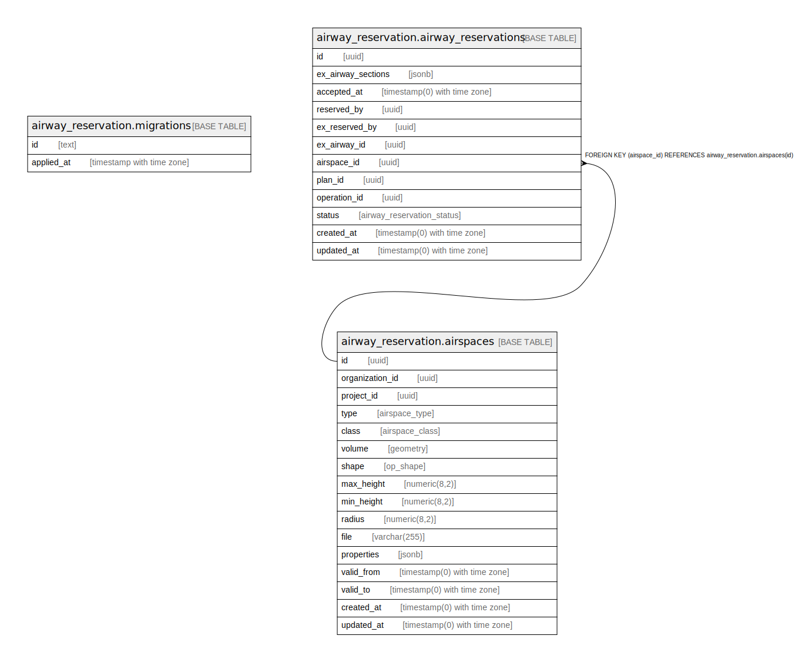

# DBドキュメント

## Tables

| Name | Columns | Comment | Type |
| ---- | ------- | ------- | ---- |
| [airway_reservation.migrations](airway_reservation.migrations.md) | 2 |  | BASE TABLE |
| [airway_reservation.airspaces](airway_reservation.airspaces.md) | 16 |  | BASE TABLE |
| [airway_reservation.airway_reservations](airway_reservation.airway_reservations.md) | 12 |  | BASE TABLE |

## Stored procedures and functions

| Name | ReturnType | Arguments | Type |
| ---- | ------- | ------- | ---- |
| public.st_wrapx | geometry | geom geometry, wrap double precision, move double precision | FUNCTION |
| public.st_xmin | float8 | box3d | FUNCTION |
| public.st_ymin | float8 | box3d | FUNCTION |
| public.st_zmin | float8 | box3d | FUNCTION |
| public.st_xmax | float8 | box3d | FUNCTION |
| public.st_ymax | float8 | box3d | FUNCTION |
| public.st_zmax | float8 | box3d | FUNCTION |
| public._postgis_deprecate | void | oldname text, newname text, version text | FUNCTION |
| public.spheroid_in | spheroid | cstring | FUNCTION |
| public.spheroid_out | cstring | spheroid | FUNCTION |
| public.geometry_in | geometry | cstring | FUNCTION |
| public.geometry_out | cstring | geometry | FUNCTION |
| public.geometry_typmod_in | int4 | cstring[] | FUNCTION |
| public.geometry_typmod_out | cstring | integer | FUNCTION |
| public.geometry_analyze | bool | internal | FUNCTION |
| public.geometry_recv | geometry | internal | FUNCTION |
| public.geometry_send | bytea | geometry | FUNCTION |
| public.geometry | geometry | geometry, integer, boolean | FUNCTION |
| public.geometry | geometry | point | FUNCTION |
| public.point | point | geometry | FUNCTION |
| public.geometry | geometry | path | FUNCTION |
| public.path | path | geometry | FUNCTION |
| public.geometry | geometry | polygon | FUNCTION |
| public.polygon | polygon | geometry | FUNCTION |
| public.st_x | float8 | geometry | FUNCTION |
| public.st_y | float8 | geometry | FUNCTION |
| public.st_z | float8 | geometry | FUNCTION |
| public.st_m | float8 | geometry | FUNCTION |
| public.box3d_in | box3d | cstring | FUNCTION |
| public.box3d_out | cstring | box3d | FUNCTION |
| public.box2d_in | box2d | cstring | FUNCTION |
| public.box2d_out | cstring | box2d | FUNCTION |
| public.box2df_in | box2df | cstring | FUNCTION |
| public.box2df_out | cstring | box2df | FUNCTION |
| public.gidx_in | gidx | cstring | FUNCTION |
| public.gidx_out | cstring | gidx | FUNCTION |
| public.geometry_lt | bool | geom1 geometry, geom2 geometry | FUNCTION |
| public.st_expand | box2d | box2d, double precision | FUNCTION |
| public.geometry_le | bool | geom1 geometry, geom2 geometry | FUNCTION |
| public.geometry_gt | bool | geom1 geometry, geom2 geometry | FUNCTION |
| public.geomfromewkt | geometry | text | FUNCTION |
| public.geometry_ge | bool | geom1 geometry, geom2 geometry | FUNCTION |
| public.geometry_eq | bool | geom1 geometry, geom2 geometry | FUNCTION |
| public.geometry_cmp | int4 | geom1 geometry, geom2 geometry | FUNCTION |
| public.geometry_sortsupport | void | internal | FUNCTION |
| public.geometry_hash | int4 | geometry | FUNCTION |
| public.geometry_gist_distance_2d | float8 | internal, geometry, integer | FUNCTION |
| public.geometry_gist_consistent_2d | bool | internal, geometry, integer | FUNCTION |
| public.geometry_gist_compress_2d | internal | internal | FUNCTION |
| public.geometry_gist_penalty_2d | internal | internal, internal, internal | FUNCTION |
| public.geometry_gist_picksplit_2d | internal | internal, internal | FUNCTION |
| public.geometry_gist_union_2d | internal | bytea, internal | FUNCTION |
| public.geometry_gist_same_2d | internal | geom1 geometry, geom2 geometry, internal | FUNCTION |
| public.geometry_gist_decompress_2d | internal | internal | FUNCTION |
| public.geometry_gist_sortsupport_2d | void | internal | FUNCTION |
| public._postgis_selectivity | float8 | tbl regclass, att_name text, geom geometry, mode text DEFAULT '2'::text | FUNCTION |
| public._postgis_join_selectivity | float8 | regclass, text, regclass, text, text DEFAULT '2'::text | FUNCTION |
| public._postgis_stats | text | tbl regclass, att_name text, text DEFAULT '2'::text | FUNCTION |
| public.st_geomfromewkt | geometry | text | FUNCTION |
| public.postgis_cache_bbox | trigger |  | FUNCTION |
| public._postgis_index_extent | box2d | tbl regclass, col text | FUNCTION |
| public.gserialized_gist_sel_2d | float8 | internal, oid, internal, integer | FUNCTION |
| public.gserialized_gist_sel_nd | float8 | internal, oid, internal, integer | FUNCTION |
| public.gserialized_gist_joinsel_2d | float8 | internal, oid, internal, smallint | FUNCTION |
| public.gserialized_gist_joinsel_nd | float8 | internal, oid, internal, smallint | FUNCTION |
| public.st_makepoint | geometry | double precision, double precision | FUNCTION |
| public.geometry_overlaps | bool | geom1 geometry, geom2 geometry | FUNCTION |
| public.geometry_same | bool | geom1 geometry, geom2 geometry | FUNCTION |
| public.geometry_distance_centroid | float8 | geom1 geometry, geom2 geometry | FUNCTION |
| public.geometry_distance_box | float8 | geom1 geometry, geom2 geometry | FUNCTION |
| public.geometry_contains | bool | geom1 geometry, geom2 geometry | FUNCTION |
| public.geometry_within | bool | geom1 geometry, geom2 geometry | FUNCTION |
| public.geometry_left | bool | geom1 geometry, geom2 geometry | FUNCTION |
| public.geometry_overleft | bool | geom1 geometry, geom2 geometry | FUNCTION |
| public.geometry_below | bool | geom1 geometry, geom2 geometry | FUNCTION |
| public.geometry_overbelow | bool | geom1 geometry, geom2 geometry | FUNCTION |
| public.geometry_overright | bool | geom1 geometry, geom2 geometry | FUNCTION |
| public.geometry_right | bool | geom1 geometry, geom2 geometry | FUNCTION |
| public.geometry_overabove | bool | geom1 geometry, geom2 geometry | FUNCTION |
| public.geometry_above | bool | geom1 geometry, geom2 geometry | FUNCTION |
| public.geometry_gist_consistent_nd | bool | internal, geometry, integer | FUNCTION |
| public.geometry_gist_compress_nd | internal | internal | FUNCTION |
| public.geometry_gist_penalty_nd | internal | internal, internal, internal | FUNCTION |
| public.geometry_gist_picksplit_nd | internal | internal, internal | FUNCTION |
| public.geometry_gist_union_nd | internal | bytea, internal | FUNCTION |
| public.geometry_gist_same_nd | internal | geometry, geometry, internal | FUNCTION |
| public.geometry_gist_decompress_nd | internal | internal | FUNCTION |
| public.geometry_overlaps_nd | bool | geometry, geometry | FUNCTION |
| public.geometry_contains_nd | bool | geometry, geometry | FUNCTION |
| public.geometry_within_nd | bool | geometry, geometry | FUNCTION |
| public.geometry_same_nd | bool | geometry, geometry | FUNCTION |
| public.geometry_distance_centroid_nd | float8 | geometry, geometry | FUNCTION |
| public.geometry_distance_cpa | float8 | geometry, geometry | FUNCTION |
| public.geometry_gist_distance_nd | float8 | internal, geometry, integer | FUNCTION |
| public.st_shiftlongitude | geometry | geometry | FUNCTION |
| public.st_expand | box2d | box box2d, dx double precision, dy double precision | FUNCTION |
| public.postgis_getbbox | box2d | geometry | FUNCTION |
| public.st_makebox2d | box2d | geom1 geometry, geom2 geometry | FUNCTION |
| public.st_estimatedextent | box2d | text, text, text, boolean | FUNCTION |
| public.st_estimatedextent | box2d | text, text, text | FUNCTION |
| public.st_estimatedextent | box2d | text, text | FUNCTION |
| public.st_findextent | box2d | text, text, text | FUNCTION |
| public.st_findextent | box2d | text, text | FUNCTION |
| public.postgis_addbbox | geometry | geometry | FUNCTION |
| public.postgis_dropbbox | geometry | geometry | FUNCTION |
| public.postgis_hasbbox | bool | geometry | FUNCTION |
| public.st_quantizecoordinates | geometry | g geometry, prec_x integer, prec_y integer DEFAULT NULL::integer, prec_z integer DEFAULT NULL::integer, prec_m integer DEFAULT NULL::integer | FUNCTION |
| public.st_memsize | int4 | geometry | FUNCTION |
| public.st_summary | text | geometry | FUNCTION |
| public.st_npoints | int4 | geometry | FUNCTION |
| public.st_nrings | int4 | geometry | FUNCTION |
| public.st_3dlength | float8 | geometry | FUNCTION |
| public.st_length2d | float8 | geometry | FUNCTION |
| public.st_length | float8 | geometry | FUNCTION |
| public.st_lengthspheroid | float8 | geometry, spheroid | FUNCTION |
| public.st_length2dspheroid | float8 | geometry, spheroid | FUNCTION |
| public.st_3dperimeter | float8 | geometry | FUNCTION |
| public.st_perimeter2d | float8 | geometry | FUNCTION |
| public.st_perimeter | float8 | geometry | FUNCTION |
| public.st_area2d | float8 | geometry | FUNCTION |
| public.st_area | float8 | geometry | FUNCTION |
| public.st_ispolygoncw | bool | geometry | FUNCTION |
| public.st_ispolygonccw | bool | geometry | FUNCTION |
| public.st_distancespheroid | float8 | geom1 geometry, geom2 geometry, spheroid | FUNCTION |
| public.st_distancespheroid | float8 | geom1 geometry, geom2 geometry | FUNCTION |
| public.st_distance | float8 | geom1 geometry, geom2 geometry | FUNCTION |
| public.st_pointinsidecircle | bool | geometry, double precision, double precision, double precision | FUNCTION |
| public.st_azimuth | float8 | geom1 geometry, geom2 geometry | FUNCTION |
| public.st_project | geometry | geom1 geometry, distance double precision, azimuth double precision | FUNCTION |
| public.st_project | geometry | geom1 geometry, geom2 geometry, distance double precision | FUNCTION |
| public.st_angle | float8 | pt1 geometry, pt2 geometry, pt3 geometry, pt4 geometry DEFAULT '0101000000000000000000F87F000000000000F87F'::geometry | FUNCTION |
| public.st_lineextend | geometry | geom geometry, distance_forward double precision, distance_backward double precision DEFAULT 0.0 | FUNCTION |
| public.st_force2d | geometry | geometry | FUNCTION |
| public.st_force3dz | geometry | geom geometry, zvalue double precision DEFAULT 0.0 | FUNCTION |
| public.st_force3d | geometry | geom geometry, zvalue double precision DEFAULT 0.0 | FUNCTION |
| public.st_force3dm | geometry | geom geometry, mvalue double precision DEFAULT 0.0 | FUNCTION |
| public.st_force4d | geometry | geom geometry, zvalue double precision DEFAULT 0.0, mvalue double precision DEFAULT 0.0 | FUNCTION |
| public.st_forcecollection | geometry | geometry | FUNCTION |
| public.st_collectionextract | geometry | geometry, integer | FUNCTION |
| public.st_collectionextract | geometry | geometry | FUNCTION |
| public.st_collectionhomogenize | geometry | geometry | FUNCTION |
| public.st_multi | geometry | geometry | FUNCTION |
| public.st_forcecurve | geometry | geometry | FUNCTION |
| public.st_forcesfs | geometry | geometry | FUNCTION |
| public.st_forcesfs | geometry | geometry, version text | FUNCTION |
| public.st_expand | box3d | box3d, double precision | FUNCTION |
| public.st_expand | box3d | box box3d, dx double precision, dy double precision, dz double precision DEFAULT 0 | FUNCTION |
| public.st_expand | geometry | geometry, double precision | FUNCTION |
| public.st_makepoint | geometry | double precision, double precision, double precision | FUNCTION |
| public.st_expand | geometry | geom geometry, dx double precision, dy double precision, dz double precision DEFAULT 0, dm double precision DEFAULT 0 | FUNCTION |
| public.st_envelope | geometry | geometry | FUNCTION |
| public.st_boundingdiagonal | geometry | geom geometry, fits boolean DEFAULT false | FUNCTION |
| public.st_reverse | geometry | geometry | FUNCTION |
| public.st_scroll | geometry | geometry, geometry | FUNCTION |
| public.st_forcepolygoncw | geometry | geometry | FUNCTION |
| public.st_forcepolygonccw | geometry | geometry | FUNCTION |
| public.st_forcerhr | geometry | geometry | FUNCTION |
| public.postgis_noop | geometry | geometry | FUNCTION |
| public.postgis_geos_noop | geometry | geometry | FUNCTION |
| public.st_normalize | geometry | geom geometry | FUNCTION |
| public.st_zmflag | int2 | geometry | FUNCTION |
| public.st_ndims | int2 | geometry | FUNCTION |
| public.st_asewkt | text | geometry | FUNCTION |
| public.st_asewkt | text | geometry, integer | FUNCTION |
| public.st_astwkb | bytea | geom geometry, prec integer DEFAULT NULL::integer, prec_z integer DEFAULT NULL::integer, prec_m integer DEFAULT NULL::integer, with_sizes boolean DEFAULT NULL::boolean, with_boxes boolean DEFAULT NULL::boolean | FUNCTION |
| public.st_astwkb | bytea | geom geometry[], ids bigint[], prec integer DEFAULT NULL::integer, prec_z integer DEFAULT NULL::integer, prec_m integer DEFAULT NULL::integer, with_sizes boolean DEFAULT NULL::boolean, with_boxes boolean DEFAULT NULL::boolean | FUNCTION |
| public.st_asewkb | bytea | geometry | FUNCTION |
| public.st_ashexewkb | text | geometry | FUNCTION |
| public.st_ashexewkb | text | geometry, text | FUNCTION |
| public.st_asewkb | bytea | geometry, text | FUNCTION |
| public.st_aslatlontext | text | geom geometry, tmpl text DEFAULT ''::text | FUNCTION |
| public.geomfromewkb | geometry | bytea | FUNCTION |
| public.st_geomfromewkb | geometry | bytea | FUNCTION |
| public.st_geomfromtwkb | geometry | bytea | FUNCTION |
| public.st_makepoint | geometry | double precision, double precision, double precision, double precision | FUNCTION |
| public.st_makepointm | geometry | double precision, double precision, double precision | FUNCTION |
| public.st_3dmakebox | box3d | geom1 geometry, geom2 geometry | FUNCTION |
| public.st_makeline | geometry | geometry[] | FUNCTION |
| public.st_linefrommultipoint | geometry | geometry | FUNCTION |
| public.st_makeline | geometry | geom1 geometry, geom2 geometry | FUNCTION |
| public.st_addpoint | geometry | geom1 geometry, geom2 geometry | FUNCTION |
| public.st_addpoint | geometry | geom1 geometry, geom2 geometry, integer | FUNCTION |
| public.st_removepoint | geometry | geometry, integer | FUNCTION |
| public.st_setpoint | geometry | geometry, integer, geometry | FUNCTION |
| public.st_makeenvelope | geometry | double precision, double precision, double precision, double precision, integer DEFAULT 0 | FUNCTION |
| public.st_tileenvelope | geometry | zoom integer, x integer, y integer, bounds geometry DEFAULT '0102000020110F00000200000093107C45F81B73C193107C45F81B73C193107C45F81B734193107C45F81B7341'::geometry, margin double precision DEFAULT 0.0 | FUNCTION |
| public.st_makepolygon | geometry | geometry, geometry[] | FUNCTION |
| public.st_makepolygon | geometry | geometry | FUNCTION |
| public.st_buildarea | geometry | geometry | FUNCTION |
| public.st_polygonize | geometry | geometry[] | FUNCTION |
| public.st_clusterintersecting | _geometry | geometry[] | FUNCTION |
| public.st_clusterwithin | _geometry | geometry[], double precision | FUNCTION |
| public.st_clusterdbscan | int4 | geometry, eps double precision, minpoints integer | w |
| public.st_clusterwithinwin | int4 | geometry, distance double precision | w |
| public.st_clusterintersectingwin | int4 | geometry | w |
| public.st_linemerge | geometry | geometry | FUNCTION |
| public.st_linemerge | geometry | geometry, boolean | FUNCTION |
| public.st_affine | geometry | geometry, double precision, double precision, double precision, double precision, double precision, double precision, double precision, double precision, double precision, double precision, double precision, double precision | FUNCTION |
| public.st_affine | geometry | geometry, double precision, double precision, double precision, double precision, double precision, double precision | FUNCTION |
| public.st_rotate | geometry | geometry, double precision | FUNCTION |
| public.st_rotate | geometry | geometry, double precision, double precision, double precision | FUNCTION |
| public.st_rotate | geometry | geometry, double precision, geometry | FUNCTION |
| public.st_rotatez | geometry | geometry, double precision | FUNCTION |
| public.st_rotatex | geometry | geometry, double precision | FUNCTION |
| public.st_rotatey | geometry | geometry, double precision | FUNCTION |
| public.st_translate | geometry | geometry, double precision, double precision, double precision | FUNCTION |
| public.st_translate | geometry | geometry, double precision, double precision | FUNCTION |
| public.st_scale | geometry | geometry, geometry | FUNCTION |
| public.st_scale | geometry | geometry, geometry, origin geometry | FUNCTION |
| public.st_scale | geometry | geometry, double precision, double precision, double precision | FUNCTION |
| public.st_scale | geometry | geometry, double precision, double precision | FUNCTION |
| public.st_transscale | geometry | geometry, double precision, double precision, double precision, double precision | FUNCTION |
| public.st_dump | geometry_dump | geometry | FUNCTION |
| public.st_dumprings | geometry_dump | geometry | FUNCTION |
| public.st_dumppoints | geometry_dump | geometry | FUNCTION |
| public.st_dumpsegments | geometry_dump | geometry | FUNCTION |
| public.populate_geometry_columns | text | use_typmod boolean DEFAULT true | FUNCTION |
| public.populate_geometry_columns | int4 | tbl_oid oid, use_typmod boolean DEFAULT true | FUNCTION |
| public.addgeometrycolumn | text | catalog_name character varying, schema_name character varying, table_name character varying, column_name character varying, new_srid_in integer, new_type character varying, new_dim integer, use_typmod boolean DEFAULT true | FUNCTION |
| public.addgeometrycolumn | text | schema_name character varying, table_name character varying, column_name character varying, new_srid integer, new_type character varying, new_dim integer, use_typmod boolean DEFAULT true | FUNCTION |
| public.addgeometrycolumn | text | table_name character varying, column_name character varying, new_srid integer, new_type character varying, new_dim integer, use_typmod boolean DEFAULT true | FUNCTION |
| public.postgis_srs | record | auth_name text, auth_srid text | FUNCTION |
| public.postgis_srs_all | record |  | FUNCTION |
| public.st_snaptogrid | geometry | geometry, double precision | FUNCTION |
| public.dropgeometrycolumn | text | catalog_name character varying, schema_name character varying, table_name character varying, column_name character varying | FUNCTION |
| public.dropgeometrycolumn | text | schema_name character varying, table_name character varying, column_name character varying | FUNCTION |
| public.dropgeometrycolumn | text | table_name character varying, column_name character varying | FUNCTION |
| public.dropgeometrytable | text | catalog_name character varying, schema_name character varying, table_name character varying | FUNCTION |
| public.dropgeometrytable | text | schema_name character varying, table_name character varying | FUNCTION |
| public.dropgeometrytable | text | table_name character varying | FUNCTION |
| public.updategeometrysrid | text | catalogn_name character varying, schema_name character varying, table_name character varying, column_name character varying, new_srid_in integer | FUNCTION |
| public.updategeometrysrid | text | character varying, character varying, character varying, integer | FUNCTION |
| public.updategeometrysrid | text | character varying, character varying, integer | FUNCTION |
| public.find_srid | int4 | character varying, character varying, character varying | FUNCTION |
| public.get_proj4_from_srid | text | integer | FUNCTION |
| public.st_setsrid | geometry | geom geometry, srid integer | FUNCTION |
| public.st_srid | int4 | geom geometry | FUNCTION |
| public.postgis_transform_geometry | geometry | geom geometry, text, text, integer | FUNCTION |
| public.postgis_srs_codes | text | auth_name text | FUNCTION |
| public.st_snaptogrid | geometry | geom1 geometry, geom2 geometry, double precision, double precision, double precision, double precision | FUNCTION |
| public.postgis_srs_search | record | bounds geometry, authname text DEFAULT 'EPSG'::text | FUNCTION |
| public.st_transform | geometry | geometry, integer | FUNCTION |
| public.st_transform | geometry | geom geometry, to_proj text | FUNCTION |
| public.st_transform | geometry | geom geometry, from_proj text, to_proj text | FUNCTION |
| public.st_transform | geometry | geom geometry, from_proj text, to_srid integer | FUNCTION |
| public.postgis_transform_pipeline_geometry | geometry | geom geometry, pipeline text, forward boolean, to_srid integer | FUNCTION |
| public.st_transformpipeline | geometry | geom geometry, pipeline text, to_srid integer DEFAULT 0 | FUNCTION |
| public.st_inversetransformpipeline | geometry | geom geometry, pipeline text, to_srid integer DEFAULT 0 | FUNCTION |
| public.postgis_version | text |  | FUNCTION |
| public.postgis_liblwgeom_version | text |  | FUNCTION |
| public.postgis_proj_version | text |  | FUNCTION |
| public.postgis_wagyu_version | text |  | FUNCTION |
| public.postgis_scripts_installed | text |  | FUNCTION |
| public.postgis_lib_version | text |  | FUNCTION |
| public.postgis_scripts_released | text |  | FUNCTION |
| public.postgis_geos_version | text |  | FUNCTION |
| public.postgis_geos_compiled_version | text |  | FUNCTION |
| public.postgis_lib_revision | text |  | FUNCTION |
| public.postgis_svn_version | text |  | FUNCTION |
| public.postgis_libxml_version | text |  | FUNCTION |
| public.postgis_scripts_build_date | text |  | FUNCTION |
| public.postgis_lib_build_date | text |  | FUNCTION |
| public._postgis_scripts_pgsql_version | text |  | FUNCTION |
| public._postgis_pgsql_version | text |  | FUNCTION |
| public.st_filterbym | geometry | geometry, double precision, double precision DEFAULT NULL::double precision, boolean DEFAULT false | FUNCTION |
| public.st_chaikinsmoothing | geometry | geometry, integer DEFAULT 1, boolean DEFAULT false | FUNCTION |
| public.st_snaptogrid | geometry | geometry, double precision, double precision, double precision, double precision | FUNCTION |
| public.postgis_extensions_upgrade | text | target_version text DEFAULT NULL::text | FUNCTION |
| public.postgis_full_version | text |  | FUNCTION |
| public.box2d | box2d | geometry | FUNCTION |
| public.box3d | box3d | geometry | FUNCTION |
| public.box | box | geometry | FUNCTION |
| public.box2d | box2d | box3d | FUNCTION |
| public.box3d | box3d | box2d | FUNCTION |
| public.box | box | box3d | FUNCTION |
| public.text | text | geometry | FUNCTION |
| public.box3dtobox | box | box3d | FUNCTION |
| public.geometry | geometry | box2d | FUNCTION |
| public.geometry | geometry | box3d | FUNCTION |
| public.geometry | geometry | text | FUNCTION |
| public.geometry | geometry | bytea | FUNCTION |
| public.bytea | bytea | geometry | FUNCTION |
| public.st_simplify | geometry | geometry, double precision | FUNCTION |
| public.st_simplify | geometry | geometry, double precision, boolean | FUNCTION |
| public.st_simplifyvw | geometry | geometry, double precision | FUNCTION |
| public.st_seteffectivearea | geometry | geometry, double precision DEFAULT '-1'::integer, integer DEFAULT 1 | FUNCTION |
| public.st_snaptogrid | geometry | geometry, double precision, double precision | FUNCTION |
| public.st_segmentize | geometry | geometry, double precision | FUNCTION |
| public.st_lineinterpolatepoint | geometry | geometry, double precision | FUNCTION |
| public.st_lineinterpolatepoints | geometry | geometry, double precision, repeat boolean DEFAULT true | FUNCTION |
| public.st_linesubstring | geometry | geometry, double precision, double precision | FUNCTION |
| public.st_linelocatepoint | float8 | geom1 geometry, geom2 geometry | FUNCTION |
| public.st_addmeasure | geometry | geometry, double precision, double precision | FUNCTION |
| public.st_closestpointofapproach | float8 | geometry, geometry | FUNCTION |
| public.st_distancecpa | float8 | geometry, geometry | FUNCTION |
| public.st_cpawithin | bool | geometry, geometry, double precision | FUNCTION |
| public.st_isvalidtrajectory | bool | geometry | FUNCTION |
| public.st_intersection | geometry | geom1 geometry, geom2 geometry, gridsize double precision DEFAULT '-1'::integer | FUNCTION |
| public.st_buffer | geometry | geom geometry, radius double precision, options text DEFAULT ''::text | FUNCTION |
| public.st_buffer | geometry | geom geometry, radius double precision, quadsegs integer | FUNCTION |
| public.st_minimumboundingradius | record | geometry, OUT center geometry, OUT radius double precision | FUNCTION |
| public.st_minimumboundingcircle | geometry | inputgeom geometry, segs_per_quarter integer DEFAULT 48 | FUNCTION |
| public.st_orientedenvelope | geometry | geometry | FUNCTION |
| public.st_offsetcurve | geometry | line geometry, distance double precision, params text DEFAULT ''::text | FUNCTION |
| public.st_generatepoints | geometry | area geometry, npoints integer | FUNCTION |
| public.st_generatepoints | geometry | area geometry, npoints integer, seed integer | FUNCTION |
| public.st_convexhull | geometry | geometry | FUNCTION |
| public.st_simplifypreservetopology | geometry | geometry, double precision | FUNCTION |
| public.st_isvalidreason | text | geometry | FUNCTION |
| public.st_isvaliddetail | valid_detail | geom geometry, flags integer DEFAULT 0 | FUNCTION |
| public.st_isvalidreason | text | geometry, integer | FUNCTION |
| public.st_isvalid | bool | geometry, integer | FUNCTION |
| public.st_hausdorffdistance | float8 | geom1 geometry, geom2 geometry | FUNCTION |
| public.st_hausdorffdistance | float8 | geom1 geometry, geom2 geometry, double precision | FUNCTION |
| public.st_relatematch | bool | text, text | FUNCTION |
| public.st_frechetdistance | float8 | geom1 geometry, geom2 geometry, double precision DEFAULT '-1'::integer | FUNCTION |
| public.st_maximuminscribedcircle | record | geometry, OUT center geometry, OUT nearest geometry, OUT radius double precision | FUNCTION |
| public.st_largestemptycircle | record | geom geometry, tolerance double precision DEFAULT 0.0, boundary geometry DEFAULT '0101000000000000000000F87F000000000000F87F'::geometry, OUT center geometry, OUT nearest geometry, OUT radius double precision | FUNCTION |
| public.st_difference | geometry | geom1 geometry, geom2 geometry, gridsize double precision DEFAULT '-1.0'::numeric | FUNCTION |
| public.st_boundary | geometry | geometry | FUNCTION |
| public.st_points | geometry | geometry | FUNCTION |
| public.st_symdifference | geometry | geom1 geometry, geom2 geometry, gridsize double precision DEFAULT '-1.0'::numeric | FUNCTION |
| public.st_symmetricdifference | geometry | geom1 geometry, geom2 geometry | FUNCTION |
| public.st_union | geometry | geom1 geometry, geom2 geometry | FUNCTION |
| public.st_union | geometry | geom1 geometry, geom2 geometry, gridsize double precision | FUNCTION |
| public.st_unaryunion | geometry | geometry, gridsize double precision DEFAULT '-1.0'::numeric | FUNCTION |
| public.st_removerepeatedpoints | geometry | geom geometry, tolerance double precision DEFAULT 0.0 | FUNCTION |
| public.st_clipbybox2d | geometry | geom geometry, box box2d | FUNCTION |
| public.st_subdivide | geometry | geom geometry, maxvertices integer DEFAULT 256, gridsize double precision DEFAULT '-1.0'::numeric | FUNCTION |
| public.st_reduceprecision | geometry | geom geometry, gridsize double precision | FUNCTION |
| public.st_makevalid | geometry | geometry | FUNCTION |
| public.st_makevalid | geometry | geom geometry, params text | FUNCTION |
| public.st_cleangeometry | geometry | geometry | FUNCTION |
| public.st_split | geometry | geom1 geometry, geom2 geometry | FUNCTION |
| public.st_sharedpaths | geometry | geom1 geometry, geom2 geometry | FUNCTION |
| public.st_snap | geometry | geom1 geometry, geom2 geometry, double precision | FUNCTION |
| public.st_node | geometry | g geometry | FUNCTION |
| public.st_delaunaytriangles | geometry | g1 geometry, tolerance double precision DEFAULT 0.0, flags integer DEFAULT 0 | FUNCTION |
| public.st_triangulatepolygon | geometry | g1 geometry | FUNCTION |
| public._st_voronoi | geometry | g1 geometry, clip geometry DEFAULT NULL::geometry, tolerance double precision DEFAULT 0.0, return_polygons boolean DEFAULT true | FUNCTION |
| public.st_voronoipolygons | geometry | g1 geometry, tolerance double precision DEFAULT 0.0, extend_to geometry DEFAULT NULL::geometry | FUNCTION |
| public.st_voronoilines | geometry | g1 geometry, tolerance double precision DEFAULT 0.0, extend_to geometry DEFAULT NULL::geometry | FUNCTION |
| public.st_combinebbox | box3d | box3d, geometry | FUNCTION |
| public.st_combinebbox | box3d | box3d, box3d | FUNCTION |
| public.st_combinebbox | box2d | box2d, geometry | FUNCTION |
| public.st_extent | box2d | geometry | a |
| public.st_3dextent | box3d | geometry | a |
| public.st_collect | geometry | geom1 geometry, geom2 geometry | FUNCTION |
| public.st_memcollect | geometry | geometry | a |
| public.st_collect | geometry | geometry[] | FUNCTION |
| public.st_memunion | geometry | geometry | a |
| public.pgis_geometry_accum_transfn | internal | internal, geometry | FUNCTION |
| public.pgis_geometry_accum_transfn | internal | internal, geometry, double precision | FUNCTION |
| public.pgis_geometry_accum_transfn | internal | internal, geometry, double precision, integer | FUNCTION |
| public.pgis_geometry_collect_finalfn | geometry | internal | FUNCTION |
| public.pgis_geometry_polygonize_finalfn | geometry | internal | FUNCTION |
| public.pgis_geometry_clusterintersecting_finalfn | _geometry | internal | FUNCTION |
| public.pgis_geometry_clusterwithin_finalfn | _geometry | internal | FUNCTION |
| public.pgis_geometry_makeline_finalfn | geometry | internal | FUNCTION |
| public.pgis_geometry_coverageunion_finalfn | geometry | internal | FUNCTION |
| public.pgis_geometry_union_parallel_transfn | internal | internal, geometry | FUNCTION |
| public.pgis_geometry_union_parallel_transfn | internal | internal, geometry, double precision | FUNCTION |
| public.pgis_geometry_union_parallel_combinefn | internal | internal, internal | FUNCTION |
| public.pgis_geometry_union_parallel_serialfn | bytea | internal | FUNCTION |
| public.pgis_geometry_union_parallel_deserialfn | internal | bytea, internal | FUNCTION |
| public.pgis_geometry_union_parallel_finalfn | geometry | internal | FUNCTION |
| public.st_union | geometry | geometry[] | FUNCTION |
| public.st_union | geometry | geometry | a |
| public.st_union | geometry | geometry, gridsize double precision | a |
| public.st_collect | geometry | geometry | a |
| public.st_clusterintersecting | _geometry | geometry | a |
| public.st_clusterwithin | _geometry | geometry, double precision | a |
| public.st_polygonize | geometry | geometry | a |
| public.st_makeline | geometry | geometry | a |
| public.st_coverageunion | geometry | geometry[] | FUNCTION |
| public.st_coverageunion | geometry | geometry | a |
| public.st_coveragesimplify | geometry | geom geometry, tolerance double precision, simplifyboundary boolean DEFAULT true | w |
| public.st_coverageinvalidedges | geometry | geom geometry, tolerance double precision DEFAULT 0.0 | w |
| public.st_clusterkmeans | int4 | geom geometry, k integer, max_radius double precision DEFAULT NULL::double precision | w |
| public.st_relate | text | geom1 geometry, geom2 geometry | FUNCTION |
| public.st_relate | text | geom1 geometry, geom2 geometry, integer | FUNCTION |
| public.st_relate | bool | geom1 geometry, geom2 geometry, text | FUNCTION |
| public.st_disjoint | bool | geom1 geometry, geom2 geometry | FUNCTION |
| public._st_linecrossingdirection | int4 | line1 geometry, line2 geometry | FUNCTION |
| public._st_dwithin | bool | geom1 geometry, geom2 geometry, double precision | FUNCTION |
| public._st_touches | bool | geom1 geometry, geom2 geometry | FUNCTION |
| public._st_intersects | bool | geom1 geometry, geom2 geometry | FUNCTION |
| public._st_crosses | bool | geom1 geometry, geom2 geometry | FUNCTION |
| public._st_contains | bool | geom1 geometry, geom2 geometry | FUNCTION |
| public._st_containsproperly | bool | geom1 geometry, geom2 geometry | FUNCTION |
| public._st_covers | bool | geom1 geometry, geom2 geometry | FUNCTION |
| public._st_coveredby | bool | geom1 geometry, geom2 geometry | FUNCTION |
| public._st_within | bool | geom1 geometry, geom2 geometry | FUNCTION |
| public._st_overlaps | bool | geom1 geometry, geom2 geometry | FUNCTION |
| public._st_dfullywithin | bool | geom1 geometry, geom2 geometry, double precision | FUNCTION |
| public._st_3ddwithin | bool | geom1 geometry, geom2 geometry, double precision | FUNCTION |
| public._st_3ddfullywithin | bool | geom1 geometry, geom2 geometry, double precision | FUNCTION |
| public._st_3dintersects | bool | geom1 geometry, geom2 geometry | FUNCTION |
| public._st_orderingequals | bool | geom1 geometry, geom2 geometry | FUNCTION |
| public._st_equals | bool | geom1 geometry, geom2 geometry | FUNCTION |
| public.postgis_index_supportfn | internal | internal | FUNCTION |
| public.st_linecrossingdirection | int4 | line1 geometry, line2 geometry | FUNCTION |
| public.st_dwithin | bool | geom1 geometry, geom2 geometry, double precision | FUNCTION |
| public.st_touches | bool | geom1 geometry, geom2 geometry | FUNCTION |
| public.st_intersects | bool | geom1 geometry, geom2 geometry | FUNCTION |
| public.st_crosses | bool | geom1 geometry, geom2 geometry | FUNCTION |
| public.st_contains | bool | geom1 geometry, geom2 geometry | FUNCTION |
| public.st_containsproperly | bool | geom1 geometry, geom2 geometry | FUNCTION |
| public.st_within | bool | geom1 geometry, geom2 geometry | FUNCTION |
| public.st_covers | bool | geom1 geometry, geom2 geometry | FUNCTION |
| public.st_coveredby | bool | geom1 geometry, geom2 geometry | FUNCTION |
| public.st_overlaps | bool | geom1 geometry, geom2 geometry | FUNCTION |
| public.st_dfullywithin | bool | geom1 geometry, geom2 geometry, double precision | FUNCTION |
| public.st_3ddwithin | bool | geom1 geometry, geom2 geometry, double precision | FUNCTION |
| public.st_3ddfullywithin | bool | geom1 geometry, geom2 geometry, double precision | FUNCTION |
| public.st_3dintersects | bool | geom1 geometry, geom2 geometry | FUNCTION |
| public.st_orderingequals | bool | geom1 geometry, geom2 geometry | FUNCTION |
| public.st_equals | bool | geom1 geometry, geom2 geometry | FUNCTION |
| public.st_isvalid | bool | geometry | FUNCTION |
| public.st_minimumclearance | float8 | geometry | FUNCTION |
| public.st_minimumclearanceline | geometry | geometry | FUNCTION |
| public.st_centroid | geometry | geometry | FUNCTION |
| public.st_geometricmedian | geometry | g geometry, tolerance double precision DEFAULT NULL::double precision, max_iter integer DEFAULT 10000, fail_if_not_converged boolean DEFAULT false | FUNCTION |
| public.st_isring | bool | geometry | FUNCTION |
| public.st_pointonsurface | geometry | geometry | FUNCTION |
| public.st_issimple | bool | geometry | FUNCTION |
| public.st_iscollection | bool | geometry | FUNCTION |
| public.equals | bool | geom1 geometry, geom2 geometry | FUNCTION |
| public._st_geomfromgml | geometry | text, integer | FUNCTION |
| public.st_geomfromgml | geometry | text, integer | FUNCTION |
| public.st_geomfromgml | geometry | text | FUNCTION |
| public.st_gmltosql | geometry | text | FUNCTION |
| public.st_gmltosql | geometry | text, integer | FUNCTION |
| public.st_geomfromkml | geometry | text | FUNCTION |
| public.st_geomfrommarc21 | geometry | marc21xml text | FUNCTION |
| public.st_asmarc21 | text | geom geometry, format text DEFAULT 'hdddmmss'::text | FUNCTION |
| public.st_geomfromgeojson | geometry | text | FUNCTION |
| public.st_geomfromgeojson | geometry | json | FUNCTION |
| public.st_geomfromgeojson | geometry | jsonb | FUNCTION |
| public.postgis_libjson_version | text |  | FUNCTION |
| public.st_linefromencodedpolyline | geometry | txtin text, nprecision integer DEFAULT 5 | FUNCTION |
| public.st_asencodedpolyline | text | geom geometry, nprecision integer DEFAULT 5 | FUNCTION |
| public.st_assvg | text | geom geometry, rel integer DEFAULT 0, maxdecimaldigits integer DEFAULT 15 | FUNCTION |
| public._st_asgml | text | integer, geometry, integer, integer, text, text | FUNCTION |
| public.st_asgml | text | geom geometry, maxdecimaldigits integer DEFAULT 15, options integer DEFAULT 0 | FUNCTION |
| public.st_asgml | text | version integer, geom geometry, maxdecimaldigits integer DEFAULT 15, options integer DEFAULT 0, nprefix text DEFAULT NULL::text, id text DEFAULT NULL::text | FUNCTION |
| public.st_askml | text | geom geometry, maxdecimaldigits integer DEFAULT 15, nprefix text DEFAULT ''::text | FUNCTION |
| public.st_asflatgeobuf | bytea | anyelement, boolean | a |
| public.st_asflatgeobuf | bytea | anyelement, boolean, text | a |
| public.st_asgeojson | text | geom geometry, maxdecimaldigits integer DEFAULT 9, options integer DEFAULT 8 | FUNCTION |
| public.st_asgeojson | text | r record, geom_column text DEFAULT ''::text, maxdecimaldigits integer DEFAULT 9, pretty_bool boolean DEFAULT false | FUNCTION |
| public.json | json | geometry | FUNCTION |
| public.jsonb | jsonb | geometry | FUNCTION |
| public.pgis_asmvt_transfn | internal | internal, anyelement | FUNCTION |
| public.pgis_asmvt_transfn | internal | internal, anyelement, text | FUNCTION |
| public.pgis_asmvt_transfn | internal | internal, anyelement, text, integer | FUNCTION |
| public.pgis_asmvt_transfn | internal | internal, anyelement, text, integer, text | FUNCTION |
| public.pgis_asmvt_transfn | internal | internal, anyelement, text, integer, text, text | FUNCTION |
| public.pgis_asmvt_finalfn | bytea | internal | FUNCTION |
| public.pgis_asmvt_combinefn | internal | internal, internal | FUNCTION |
| public.pgis_asmvt_serialfn | bytea | internal | FUNCTION |
| public.pgis_asmvt_deserialfn | internal | bytea, internal | FUNCTION |
| public.st_asmvt | bytea | anyelement | a |
| public.st_asmvt | bytea | anyelement, text | a |
| public.st_asmvt | bytea | anyelement, text, integer | a |
| public.st_asmvt | bytea | anyelement, text, integer, text | a |
| public.st_asmvt | bytea | anyelement, text, integer, text, text | a |
| public.st_asmvtgeom | geometry | geom geometry, bounds box2d, extent integer DEFAULT 4096, buffer integer DEFAULT 256, clip_geom boolean DEFAULT true | FUNCTION |
| public.postgis_libprotobuf_version | text |  | FUNCTION |
| public.pgis_asgeobuf_transfn | internal | internal, anyelement | FUNCTION |
| public.pgis_asgeobuf_transfn | internal | internal, anyelement, text | FUNCTION |
| public.pgis_asgeobuf_finalfn | bytea | internal | FUNCTION |
| public.st_asgeobuf | bytea | anyelement | a |
| public.st_asgeobuf | bytea | anyelement, text | a |
| public.pgis_asflatgeobuf_transfn | internal | internal, anyelement | FUNCTION |
| public.pgis_asflatgeobuf_transfn | internal | internal, anyelement, boolean | FUNCTION |
| public.pgis_asflatgeobuf_transfn | internal | internal, anyelement, boolean, text | FUNCTION |
| public.pgis_asflatgeobuf_finalfn | bytea | internal | FUNCTION |
| public.st_asflatgeobuf | bytea | anyelement | a |
| public.st_fromflatgeobuftotable | void | text, text, bytea | FUNCTION |
| public.st_fromflatgeobuf | anyelement | anyelement, bytea | FUNCTION |
| public.st_geohash | text | geom geometry, maxchars integer DEFAULT 0 | FUNCTION |
| public._st_sortablehash | int8 | geom geometry | FUNCTION |
| public.st_box2dfromgeohash | box2d | text, integer DEFAULT NULL::integer | FUNCTION |
| public.st_pointfromgeohash | geometry | text, integer DEFAULT NULL::integer | FUNCTION |
| public.st_geomfromgeohash | geometry | text, integer DEFAULT NULL::integer | FUNCTION |
| public.st_numpoints | int4 | geometry | FUNCTION |
| public.st_numgeometries | int4 | geometry | FUNCTION |
| public.st_geometryn | geometry | geometry, integer | FUNCTION |
| public.st_dimension | int4 | geometry | FUNCTION |
| public.st_exteriorring | geometry | geometry | FUNCTION |
| public.st_numinteriorrings | int4 | geometry | FUNCTION |
| public.st_numinteriorring | int4 | geometry | FUNCTION |
| public.st_interiorringn | geometry | geometry, integer | FUNCTION |
| public.geometrytype | text | geometry | FUNCTION |
| public.st_geometrytype | text | geometry | FUNCTION |
| public.st_pointn | geometry | geometry, integer | FUNCTION |
| public.st_numpatches | int4 | geometry | FUNCTION |
| public.st_patchn | geometry | geometry, integer | FUNCTION |
| public.st_startpoint | geometry | geometry | FUNCTION |
| public.st_endpoint | geometry | geometry | FUNCTION |
| public.st_isclosed | bool | geometry | FUNCTION |
| public.st_isempty | bool | geometry | FUNCTION |
| public.st_asbinary | bytea | geometry, text | FUNCTION |
| public.st_asbinary | bytea | geometry | FUNCTION |
| public.st_astext | text | geometry | FUNCTION |
| public.st_astext | text | geometry, integer | FUNCTION |
| public.st_geometryfromtext | geometry | text | FUNCTION |
| public.st_geometryfromtext | geometry | text, integer | FUNCTION |
| public.st_geomfromtext | geometry | text | FUNCTION |
| public.st_geomfromtext | geometry | text, integer | FUNCTION |
| public.st_wkttosql | geometry | text | FUNCTION |
| public.st_pointfromtext | geometry | text | FUNCTION |
| public.st_pointfromtext | geometry | text, integer | FUNCTION |
| public.st_linefromtext | geometry | text | FUNCTION |
| public.st_linefromtext | geometry | text, integer | FUNCTION |
| public.st_polyfromtext | geometry | text | FUNCTION |
| public.st_polyfromtext | geometry | text, integer | FUNCTION |
| public.st_polygonfromtext | geometry | text, integer | FUNCTION |
| public.st_polygonfromtext | geometry | text | FUNCTION |
| public.st_mlinefromtext | geometry | text, integer | FUNCTION |
| public.st_mlinefromtext | geometry | text | FUNCTION |
| public.st_multilinestringfromtext | geometry | text | FUNCTION |
| public.st_multilinestringfromtext | geometry | text, integer | FUNCTION |
| public.st_mpointfromtext | geometry | text, integer | FUNCTION |
| public.st_mpointfromtext | geometry | text | FUNCTION |
| public.st_multipointfromtext | geometry | text | FUNCTION |
| public.st_mpolyfromtext | geometry | text, integer | FUNCTION |
| public.st_mpolyfromtext | geometry | text | FUNCTION |
| public.st_multipolygonfromtext | geometry | text, integer | FUNCTION |
| public.st_multipolygonfromtext | geometry | text | FUNCTION |
| public.st_geomcollfromtext | geometry | text, integer | FUNCTION |
| public.st_geomcollfromtext | geometry | text | FUNCTION |
| public.st_geomfromwkb | geometry | bytea | FUNCTION |
| public.st_geomfromwkb | geometry | bytea, integer | FUNCTION |
| public.st_pointfromwkb | geometry | bytea, integer | FUNCTION |
| public.st_pointfromwkb | geometry | bytea | FUNCTION |
| public.st_linefromwkb | geometry | bytea, integer | FUNCTION |
| public.st_linefromwkb | geometry | bytea | FUNCTION |
| public.st_linestringfromwkb | geometry | bytea, integer | FUNCTION |
| public.st_linestringfromwkb | geometry | bytea | FUNCTION |
| public.st_polyfromwkb | geometry | bytea, integer | FUNCTION |
| public.st_polyfromwkb | geometry | bytea | FUNCTION |
| public.st_polygonfromwkb | geometry | bytea, integer | FUNCTION |
| public.st_polygonfromwkb | geometry | bytea | FUNCTION |
| public.st_mpointfromwkb | geometry | bytea, integer | FUNCTION |
| public.st_mpointfromwkb | geometry | bytea | FUNCTION |
| public.st_multipointfromwkb | geometry | bytea, integer | FUNCTION |
| public.st_multipointfromwkb | geometry | bytea | FUNCTION |
| public.st_multilinefromwkb | geometry | bytea | FUNCTION |
| public.st_mlinefromwkb | geometry | bytea, integer | FUNCTION |
| public.st_mlinefromwkb | geometry | bytea | FUNCTION |
| public.st_mpolyfromwkb | geometry | bytea, integer | FUNCTION |
| public.st_mpolyfromwkb | geometry | bytea | FUNCTION |
| public.st_multipolyfromwkb | geometry | bytea, integer | FUNCTION |
| public.st_multipolyfromwkb | geometry | bytea | FUNCTION |
| public.st_geomcollfromwkb | geometry | bytea, integer | FUNCTION |
| public.st_geomcollfromwkb | geometry | bytea | FUNCTION |
| public._st_maxdistance | float8 | geom1 geometry, geom2 geometry | FUNCTION |
| public.st_maxdistance | float8 | geom1 geometry, geom2 geometry | FUNCTION |
| public.st_closestpoint | geometry | geom1 geometry, geom2 geometry | FUNCTION |
| public.st_shortestline | geometry | geom1 geometry, geom2 geometry | FUNCTION |
| public._st_longestline | geometry | geom1 geometry, geom2 geometry | FUNCTION |
| public.st_longestline | geometry | geom1 geometry, geom2 geometry | FUNCTION |
| public.st_swapordinates | geometry | geom geometry, ords cstring | FUNCTION |
| public.st_flipcoordinates | geometry | geometry | FUNCTION |
| public.geography_lt | bool | geography, geography | FUNCTION |
| public.st_bdpolyfromtext | geometry | text, integer | FUNCTION |
| public.st_bdmpolyfromtext | geometry | text, integer | FUNCTION |
| public.unlockrows | int4 | text | FUNCTION |
| public.lockrow | int4 | text, text, text, text, timestamp without time zone | FUNCTION |
| public.lockrow | int4 | text, text, text, text | FUNCTION |
| public.lockrow | int4 | text, text, text | FUNCTION |
| public.lockrow | int4 | text, text, text, timestamp without time zone | FUNCTION |
| public.addauth | bool | text | FUNCTION |
| public.checkauth | int4 | text, text, text | FUNCTION |
| public.checkauth | int4 | text, text | FUNCTION |
| public.checkauthtrigger | trigger |  | FUNCTION |
| public.gettransactionid | xid |  | FUNCTION |
| public.enablelongtransactions | text |  | FUNCTION |
| public.longtransactionsenabled | bool |  | FUNCTION |
| public.overlaps_geog | bool | gidx, gidx | FUNCTION |
| public.overlaps_geog | bool | geography, gidx | FUNCTION |
| public.geog_brin_inclusion_add_value | bool | internal, internal, internal, internal | FUNCTION |
| public.disablelongtransactions | text |  | FUNCTION |
| public.geography_typmod_in | int4 | cstring[] | FUNCTION |
| public.geography_typmod_out | cstring | integer | FUNCTION |
| public.geography_in | geography | cstring, oid, integer | FUNCTION |
| public.geography_out | cstring | geography | FUNCTION |
| public.geography_recv | geography | internal, oid, integer | FUNCTION |
| public.geography_send | bytea | geography | FUNCTION |
| public.geography_analyze | bool | internal | FUNCTION |
| public.geography | geography | geography, integer, boolean | FUNCTION |
| public.geography | geography | bytea | FUNCTION |
| public.bytea | bytea | geography | FUNCTION |
| public.st_astext | text | geography | FUNCTION |
| public.st_astext | text | geography, integer | FUNCTION |
| public.st_astext | text | text | FUNCTION |
| public.st_geographyfromtext | geography | text | FUNCTION |
| public.st_geogfromtext | geography | text | FUNCTION |
| public.st_geogfromwkb | geography | bytea | FUNCTION |
| public.postgis_typmod_dims | int4 | integer | FUNCTION |
| public.postgis_typmod_srid | int4 | integer | FUNCTION |
| public.postgis_typmod_type | text | integer | FUNCTION |
| public.geography | geography | geometry | FUNCTION |
| public.geometry | geometry | geography | FUNCTION |
| public.geography_gist_consistent | bool | internal, geography, integer | FUNCTION |
| public.geography_gist_compress | internal | internal | FUNCTION |
| public.geography_gist_penalty | internal | internal, internal, internal | FUNCTION |
| public.geography_gist_picksplit | internal | internal, internal | FUNCTION |
| public.geography_gist_union | internal | bytea, internal | FUNCTION |
| public.geography_gist_same | internal | box2d, box2d, internal | FUNCTION |
| public.geography_gist_decompress | internal | internal | FUNCTION |
| public.geography_overlaps | bool | geography, geography | FUNCTION |
| public.geography_distance_knn | float8 | geography, geography | FUNCTION |
| public.geography_gist_distance | float8 | internal, geography, integer | FUNCTION |
| public.overlaps_geog | bool | gidx, geography | FUNCTION |
| public.geography_le | bool | geography, geography | FUNCTION |
| public.geography_gt | bool | geography, geography | FUNCTION |
| public.geography_ge | bool | geography, geography | FUNCTION |
| public.geography_eq | bool | geography, geography | FUNCTION |
| public.geography_cmp | int4 | geography, geography | FUNCTION |
| public.st_assvg | text | geog geography, rel integer DEFAULT 0, maxdecimaldigits integer DEFAULT 15 | FUNCTION |
| public.st_assvg | text | text | FUNCTION |
| public.st_asgml | text | version integer, geog geography, maxdecimaldigits integer DEFAULT 15, options integer DEFAULT 0, nprefix text DEFAULT 'gml'::text, id text DEFAULT ''::text | FUNCTION |
| public.st_asgml | text | geog geography, maxdecimaldigits integer DEFAULT 15, options integer DEFAULT 0, nprefix text DEFAULT 'gml'::text, id text DEFAULT ''::text | FUNCTION |
| public.st_asgml | text | text | FUNCTION |
| public.st_askml | text | geog geography, maxdecimaldigits integer DEFAULT 15, nprefix text DEFAULT ''::text | FUNCTION |
| public.st_askml | text | text | FUNCTION |
| public.st_asgeojson | text | geog geography, maxdecimaldigits integer DEFAULT 9, options integer DEFAULT 0 | FUNCTION |
| public.st_asgeojson | text | text | FUNCTION |
| public.st_distance | float8 | geog1 geography, geog2 geography, use_spheroid boolean DEFAULT true | FUNCTION |
| public.st_distance | float8 | text, text | FUNCTION |
| public._st_expand | geography | geography, double precision | FUNCTION |
| public._st_distanceuncached | float8 | geography, geography, double precision, boolean | FUNCTION |
| public._st_distanceuncached | float8 | geography, geography, boolean | FUNCTION |
| public._st_distanceuncached | float8 | geography, geography | FUNCTION |
| public._st_distancetree | float8 | geography, geography, double precision, boolean | FUNCTION |
| public._st_distancetree | float8 | geography, geography | FUNCTION |
| public._st_dwithinuncached | bool | geography, geography, double precision, boolean | FUNCTION |
| public._st_dwithinuncached | bool | geography, geography, double precision | FUNCTION |
| public.st_area | float8 | geog geography, use_spheroid boolean DEFAULT true | FUNCTION |
| public.st_area | float8 | text | FUNCTION |
| public.st_length | float8 | geog geography, use_spheroid boolean DEFAULT true | FUNCTION |
| public.st_length | float8 | text | FUNCTION |
| public.st_project | geography | geog geography, distance double precision, azimuth double precision | FUNCTION |
| public.st_project | geography | geog_from geography, geog_to geography, distance double precision | FUNCTION |
| public.st_azimuth | float8 | geog1 geography, geog2 geography | FUNCTION |
| public.st_perimeter | float8 | geog geography, use_spheroid boolean DEFAULT true | FUNCTION |
| public._st_pointoutside | geography | geography | FUNCTION |
| public.st_segmentize | geography | geog geography, max_segment_length double precision | FUNCTION |
| public._st_bestsrid | int4 | geography, geography | FUNCTION |
| public._st_bestsrid | int4 | geography | FUNCTION |
| public.st_asbinary | bytea | geography | FUNCTION |
| public.st_asbinary | bytea | geography, text | FUNCTION |
| public.st_asewkt | text | geography | FUNCTION |
| public.st_asewkt | text | geography, integer | FUNCTION |
| public.st_asewkt | text | text | FUNCTION |
| public.geometrytype | text | geography | FUNCTION |
| public.st_summary | text | geography | FUNCTION |
| public.st_geohash | text | geog geography, maxchars integer DEFAULT 0 | FUNCTION |
| public.st_srid | int4 | geog geography | FUNCTION |
| public.st_setsrid | geography | geog geography, srid integer | FUNCTION |
| public.st_centroid | geography | geography, use_spheroid boolean DEFAULT true | FUNCTION |
| public.st_centroid | geometry | text | FUNCTION |
| public._st_covers | bool | geog1 geography, geog2 geography | FUNCTION |
| public._st_dwithin | bool | geog1 geography, geog2 geography, tolerance double precision, use_spheroid boolean DEFAULT true | FUNCTION |
| public._st_coveredby | bool | geog1 geography, geog2 geography | FUNCTION |
| public.st_covers | bool | geog1 geography, geog2 geography | FUNCTION |
| public.st_dwithin | bool | geog1 geography, geog2 geography, tolerance double precision, use_spheroid boolean DEFAULT true | FUNCTION |
| public.st_coveredby | bool | geog1 geography, geog2 geography | FUNCTION |
| public.st_intersects | bool | geog1 geography, geog2 geography | FUNCTION |
| public.st_buffer | geography | geography, double precision | FUNCTION |
| public.st_buffer | geography | geography, double precision, integer | FUNCTION |
| public.st_buffer | geography | geography, double precision, text | FUNCTION |
| public.st_buffer | geometry | text, double precision | FUNCTION |
| public.st_buffer | geometry | text, double precision, integer | FUNCTION |
| public.st_buffer | geometry | text, double precision, text | FUNCTION |
| public.st_intersection | geography | geography, geography | FUNCTION |
| public.st_intersection | geometry | text, text | FUNCTION |
| public.st_covers | bool | text, text | FUNCTION |
| public.st_coveredby | bool | text, text | FUNCTION |
| public.st_dwithin | bool | text, text, double precision | FUNCTION |
| public.st_intersects | bool | text, text | FUNCTION |
| public.st_closestpoint | geography | geography, geography, use_spheroid boolean DEFAULT true | FUNCTION |
| public.st_closestpoint | geometry | text, text | FUNCTION |
| public.st_shortestline | geography | geography, geography, use_spheroid boolean DEFAULT true | FUNCTION |
| public.st_shortestline | geometry | text, text | FUNCTION |
| public.st_linesubstring | geography | geography, double precision, double precision | FUNCTION |
| public.st_linesubstring | geometry | text, double precision, double precision | FUNCTION |
| public.st_linelocatepoint | float8 | geography, geography, use_spheroid boolean DEFAULT true | FUNCTION |
| public.st_linelocatepoint | float8 | text, text | FUNCTION |
| public.st_lineinterpolatepoints | geography | geography, double precision, use_spheroid boolean DEFAULT true, repeat boolean DEFAULT true | FUNCTION |
| public.st_lineinterpolatepoints | geometry | text, double precision | FUNCTION |
| public.geom2d_brin_inclusion_add_value | bool | internal, internal, internal, internal | FUNCTION |
| public.st_lineinterpolatepoint | geography | geography, double precision, use_spheroid boolean DEFAULT true | FUNCTION |
| public.st_lineinterpolatepoint | geometry | text, double precision | FUNCTION |
| public.st_distancesphere | float8 | geom1 geometry, geom2 geometry | FUNCTION |
| public.st_distancesphere | float8 | geom1 geometry, geom2 geometry, radius double precision | FUNCTION |
| public.postgis_type_name | varchar | geomname character varying, coord_dimension integer, use_new_name boolean DEFAULT true | FUNCTION |
| public.postgis_constraint_srid | int4 | geomschema text, geomtable text, geomcolumn text | FUNCTION |
| public.postgis_constraint_dims | int4 | geomschema text, geomtable text, geomcolumn text | FUNCTION |
| public.postgis_constraint_type | varchar | geomschema text, geomtable text, geomcolumn text | FUNCTION |
| public.st_3ddistance | float8 | geom1 geometry, geom2 geometry | FUNCTION |
| public.st_3dmaxdistance | float8 | geom1 geometry, geom2 geometry | FUNCTION |
| public.st_3dclosestpoint | geometry | geom1 geometry, geom2 geometry | FUNCTION |
| public.st_3dshortestline | geometry | geom1 geometry, geom2 geometry | FUNCTION |
| public.st_3dlongestline | geometry | geom1 geometry, geom2 geometry | FUNCTION |
| public.st_coorddim | int2 | geometry geometry | FUNCTION |
| public.st_curvetoline | geometry | geom geometry, tol double precision DEFAULT 32, toltype integer DEFAULT 0, flags integer DEFAULT 0 | FUNCTION |
| public.st_hasarc | bool | geometry geometry | FUNCTION |
| public.st_linetocurve | geometry | geometry geometry | FUNCTION |
| public.st_point | geometry | double precision, double precision | FUNCTION |
| public.st_point | geometry | double precision, double precision, srid integer | FUNCTION |
| public.st_pointz | geometry | xcoordinate double precision, ycoordinate double precision, zcoordinate double precision, srid integer DEFAULT 0 | FUNCTION |
| public.st_pointm | geometry | xcoordinate double precision, ycoordinate double precision, mcoordinate double precision, srid integer DEFAULT 0 | FUNCTION |
| public.st_pointzm | geometry | xcoordinate double precision, ycoordinate double precision, zcoordinate double precision, mcoordinate double precision, srid integer DEFAULT 0 | FUNCTION |
| public.st_polygon | geometry | geometry, integer | FUNCTION |
| public.st_wkbtosql | geometry | wkb bytea | FUNCTION |
| public.st_locatebetween | geometry | geometry geometry, frommeasure double precision, tomeasure double precision, leftrightoffset double precision DEFAULT 0.0 | FUNCTION |
| public.st_locatealong | geometry | geometry geometry, measure double precision, leftrightoffset double precision DEFAULT 0.0 | FUNCTION |
| public.st_locatebetweenelevations | geometry | geometry geometry, fromelevation double precision, toelevation double precision | FUNCTION |
| public.st_interpolatepoint | float8 | line geometry, point geometry | FUNCTION |
| public.st_hexagon | geometry | size double precision, cell_i integer, cell_j integer, origin geometry DEFAULT '010100000000000000000000000000000000000000'::geometry | FUNCTION |
| public.st_square | geometry | size double precision, cell_i integer, cell_j integer, origin geometry DEFAULT '010100000000000000000000000000000000000000'::geometry | FUNCTION |
| public.st_hexagongrid | record | size double precision, bounds geometry, OUT geom geometry, OUT i integer, OUT j integer | FUNCTION |
| public.st_squaregrid | record | size double precision, bounds geometry, OUT geom geometry, OUT i integer, OUT j integer | FUNCTION |
| public.contains_2d | bool | box2df, geometry | FUNCTION |
| public.is_contained_2d | bool | box2df, geometry | FUNCTION |
| public.overlaps_2d | bool | box2df, geometry | FUNCTION |
| public.overlaps_2d | bool | box2df, box2df | FUNCTION |
| public.contains_2d | bool | box2df, box2df | FUNCTION |
| public.is_contained_2d | bool | box2df, box2df | FUNCTION |
| public.contains_2d | bool | geometry, box2df | FUNCTION |
| public.is_contained_2d | bool | geometry, box2df | FUNCTION |
| public.overlaps_2d | bool | geometry, box2df | FUNCTION |
| public.overlaps_nd | bool | gidx, geometry | FUNCTION |
| public.overlaps_nd | bool | gidx, gidx | FUNCTION |
| public.overlaps_nd | bool | geometry, gidx | FUNCTION |
| public.geom3d_brin_inclusion_add_value | bool | internal, internal, internal, internal | FUNCTION |
| public.geom4d_brin_inclusion_add_value | bool | internal, internal, internal, internal | FUNCTION |
| public.st_simplifypolygonhull | geometry | geom geometry, vertex_fraction double precision, is_outer boolean DEFAULT true | FUNCTION |
| public._st_concavehull | geometry | param_inputgeom geometry | FUNCTION |
| public.st_concavehull | geometry | param_geom geometry, param_pctconvex double precision, param_allow_holes boolean DEFAULT false | FUNCTION |
| public._st_asx3d | text | integer, geometry, integer, integer, text | FUNCTION |
| public.st_asx3d | text | geom geometry, maxdecimaldigits integer DEFAULT 15, options integer DEFAULT 0 | FUNCTION |
| public.st_angle | float8 | line1 geometry, line2 geometry | FUNCTION |
| public.st_3dlineinterpolatepoint | geometry | geometry, double precision | FUNCTION |
| public.geometry_spgist_config_2d | void | internal, internal | FUNCTION |
| public.geometry_spgist_choose_2d | void | internal, internal | FUNCTION |
| public.geometry_spgist_picksplit_2d | void | internal, internal | FUNCTION |
| public.geometry_spgist_inner_consistent_2d | void | internal, internal | FUNCTION |
| public.geometry_spgist_leaf_consistent_2d | bool | internal, internal | FUNCTION |
| public.geometry_spgist_compress_2d | internal | internal | FUNCTION |
| public.geometry_overlaps_3d | bool | geom1 geometry, geom2 geometry | FUNCTION |
| public.geometry_contains_3d | bool | geom1 geometry, geom2 geometry | FUNCTION |
| public.geometry_contained_3d | bool | geom1 geometry, geom2 geometry | FUNCTION |
| public.geometry_same_3d | bool | geom1 geometry, geom2 geometry | FUNCTION |
| public.geometry_spgist_config_3d | void | internal, internal | FUNCTION |
| public.geometry_spgist_choose_3d | void | internal, internal | FUNCTION |
| public.geometry_spgist_picksplit_3d | void | internal, internal | FUNCTION |
| public.geometry_spgist_inner_consistent_3d | void | internal, internal | FUNCTION |
| public.geometry_spgist_leaf_consistent_3d | bool | internal, internal | FUNCTION |
| public.geometry_spgist_compress_3d | internal | internal | FUNCTION |
| public.geometry_spgist_config_nd | void | internal, internal | FUNCTION |
| public.geometry_spgist_choose_nd | void | internal, internal | FUNCTION |
| public.geometry_spgist_picksplit_nd | void | internal, internal | FUNCTION |
| public.geometry_spgist_inner_consistent_nd | void | internal, internal | FUNCTION |
| public.geometry_spgist_leaf_consistent_nd | bool | internal, internal | FUNCTION |
| public.geometry_spgist_compress_nd | internal | internal | FUNCTION |
| public.geography_spgist_config_nd | void | internal, internal | FUNCTION |
| public.geography_spgist_choose_nd | void | internal, internal | FUNCTION |
| public.geography_spgist_picksplit_nd | void | internal, internal | FUNCTION |
| public.geography_spgist_inner_consistent_nd | void | internal, internal | FUNCTION |
| public.geography_spgist_leaf_consistent_nd | bool | internal, internal | FUNCTION |
| public.geography_spgist_compress_nd | internal | internal | FUNCTION |
| public.st_letters | geometry | letters text, font json DEFAULT NULL::json | FUNCTION |
| topology.layertrigger | trigger |  | FUNCTION |
| topology.relationtrigger | trigger |  | FUNCTION |
| topology.droptopogeometrycolumn | text | schema character varying, tbl character varying, col character varying | FUNCTION |
| topology.polygonize | text | toponame character varying | FUNCTION |
| topology.topoelementarray_append | topoelementarray | topoelementarray, topoelement | FUNCTION |
| topology.populate_topology_layer | record |  | FUNCTION |
| topology.createtopogeom | topogeometry | toponame character varying, tg_type integer, layer_id integer, tg_objs topoelementarray | FUNCTION |
| topology.createtopogeom | topogeometry | toponame character varying, tg_type integer, layer_id integer | FUNCTION |
| topology.gettopologyname | varchar | topoid integer | FUNCTION |
| topology.gettopologyid | int4 | toponame character varying | FUNCTION |
| topology.gettopologysrid | int4 | toponame character varying | FUNCTION |
| topology.gettopogeomelementarray | topoelementarray | toponame character varying, layer_id integer, tgid integer | FUNCTION |
| topology.gettopogeomelementarray | topoelementarray | tg topogeometry | FUNCTION |
| topology.gettopogeomelements | topoelement | toponame character varying, layerid integer, tgid integer | FUNCTION |
| topology.gettopogeomelements | topoelement | tg topogeometry | FUNCTION |
| topology.topoelementarray_agg | topoelementarray | topoelement | a |
| topology.geometry | geometry | topogeom topogeometry | FUNCTION |
| topology.topoelement | topoelement | topo topogeometry | FUNCTION |
| topology.droptopology | text | atopology character varying | FUNCTION |
| topology.intersects | bool | tg1 topogeometry, tg2 topogeometry | FUNCTION |
| topology.equals | bool | tg1 topogeometry, tg2 topogeometry | FUNCTION |
| topology.getnodebypoint | int4 | atopology character varying, apoint geometry, tol1 double precision | FUNCTION |
| topology.getedgebypoint | int4 | atopology character varying, apoint geometry, tol1 double precision | FUNCTION |
| topology.geometrytype | text | tg topogeometry | FUNCTION |
| topology.st_geometrytype | text | tg topogeometry | FUNCTION |
| topology.st_srid | int4 | tg topogeometry | FUNCTION |
| topology.st_removeisonode | text | atopology character varying, anode integer | FUNCTION |
| topology.st_remisonode | text | character varying, integer | FUNCTION |
| topology.getfacebypoint | int4 | atopology character varying, apoint geometry, tol1 double precision | FUNCTION |
| topology.getfacecontainingpoint | int4 | atopology text, apoint geometry | FUNCTION |
| topology._st_mintolerance | float8 | ageom geometry | FUNCTION |
| topology._st_mintolerance | float8 | atopology character varying, ageom geometry | FUNCTION |
| topology.addnode | int4 | atopology character varying, apoint geometry, allowedgesplitting boolean DEFAULT false, setcontainingface boolean DEFAULT false | FUNCTION |
| topology.addedge | int4 | atopology character varying, aline geometry | FUNCTION |
| topology.addface | int4 | atopology character varying, apoly geometry, force_new boolean DEFAULT false | FUNCTION |
| topology.topogeo_addpoint | int4 | atopology character varying, apoint geometry, tolerance double precision DEFAULT 0 | FUNCTION |
| topology.topogeo_addlinestring | int4 | atopology character varying, aline geometry, tolerance double precision DEFAULT 0 | FUNCTION |
| topology.topogeo_addpolygon | int4 | atopology character varying, apoly geometry, tolerance double precision DEFAULT 0 | FUNCTION |
| topology.topogeo_addgeometry | void | atopology character varying, ageom geometry, tolerance double precision DEFAULT 0 | FUNCTION |
| topology.st_addisonode | int4 | atopology character varying, aface integer, apoint geometry | FUNCTION |
| topology.cleartopogeom | topogeometry | tg topogeometry | FUNCTION |
| topology.st_simplify | geometry | tg topogeometry, tolerance double precision | FUNCTION |
| topology.totopogeom | topogeometry | ageom geometry, atopology character varying, alayer integer, atolerance double precision DEFAULT 0 | FUNCTION |
| topology.totopogeom | topogeometry | ageom geometry, tg topogeometry, atolerance double precision DEFAULT 0 | FUNCTION |
| topology.topogeom_addelement | topogeometry | tg topogeometry, el topoelement | FUNCTION |
| topology.topogeom_remelement | topogeometry | tg topogeometry, el topoelement | FUNCTION |
| topology.topogeom_addtopogeom | topogeometry | tgt topogeometry, src topogeometry | FUNCTION |
| topology.st_moveisonode | text | atopology character varying, anode integer, apoint geometry | FUNCTION |
| topology._asgmlnode | text | id integer, point geometry, nsprefix_in text, prec integer, options integer, idprefix text, gmlver integer | FUNCTION |
| topology._asgmledge | text | edge_id integer, start_node integer, end_node integer, line geometry, visitedtable regclass, nsprefix_in text, prec integer, options integer, idprefix text, gmlver integer | FUNCTION |
| topology._asgmlface | text | toponame text, face_id integer, visitedtable regclass, nsprefix_in text, prec integer, options integer, idprefix text, gmlver integer | FUNCTION |
| topology.asgml | text | tg topogeometry, nsprefix_in text, precision_in integer, options_in integer, visitedtable regclass, idprefix text, gmlver integer | FUNCTION |
| topology.asgml | text | tg topogeometry, nsprefix text, prec integer, options integer, visitedtable regclass, idprefix text | FUNCTION |
| topology.asgml | text | tg topogeometry, nsprefix text, prec integer, options integer, vis regclass | FUNCTION |
| topology.asgml | text | tg topogeometry, nsprefix text, prec integer, opts integer | FUNCTION |
| topology.asgml | text | tg topogeometry, nsprefix text | FUNCTION |
| topology.asgml | text | tg topogeometry, visitedtable regclass | FUNCTION |
| topology.asgml | text | tg topogeometry, visitedtable regclass, nsprefix text | FUNCTION |
| topology.asgml | text | tg topogeometry | FUNCTION |
| topology.astopojson | text | tg topogeometry, edgemaptable regclass | FUNCTION |
| topology.st_getfaceedges | getfaceedges_returntype | toponame character varying, face_id integer | FUNCTION |
| topology.st_newedgeheal | int4 | toponame character varying, e1id integer, e2id integer | FUNCTION |
| topology.st_modedgeheal | int4 | toponame character varying, e1id integer, e2id integer | FUNCTION |
| topology.st_remedgenewface | int4 | toponame character varying, e1id integer | FUNCTION |
| topology.st_remedgemodface | int4 | toponame character varying, e1id integer | FUNCTION |
| topology.st_getfacegeometry | geometry | toponame character varying, aface integer | FUNCTION |
| public.levenshtein | int4 | text, text, integer, integer, integer | FUNCTION |
| topology.st_removeisoedge | text | atopology character varying, anedge integer | FUNCTION |
| topology.st_newedgessplit | int4 | atopology character varying, anedge integer, apoint geometry | FUNCTION |
| topology.st_modedgesplit | int4 | atopology character varying, anedge integer, apoint geometry | FUNCTION |
| topology.st_addisoedge | int4 | atopology character varying, anode integer, anothernode integer, acurve geometry | FUNCTION |
| topology._st_adjacentedges | _int4 | atopology character varying, anode integer, anedge integer | FUNCTION |
| topology.st_changeedgegeom | text | atopology character varying, anedge integer, acurve geometry | FUNCTION |
| topology.st_addedgenewfaces | int4 | atopology character varying, anode integer, anothernode integer, acurve geometry | FUNCTION |
| topology.st_addedgemodface | int4 | atopology character varying, anode integer, anothernode integer, acurve geometry | FUNCTION |
| topology.st_inittopogeo | text | atopology character varying | FUNCTION |
| topology.st_createtopogeo | text | atopology character varying, acollection geometry | FUNCTION |
| topology.getringedges | getfaceedges_returntype | atopology character varying, anedge integer, maxedges integer DEFAULT NULL::integer | FUNCTION |
| topology.getnodeedges | getfaceedges_returntype | atopology character varying, anode integer | FUNCTION |
| public.levenshtein_less_equal | int4 | text, text, integer | FUNCTION |
| public.levenshtein_less_equal | int4 | text, text, integer, integer, integer, integer | FUNCTION |
| public.metaphone | text | text, integer | FUNCTION |
| public.soundex | text | text | FUNCTION |
| topology.addtosearchpath | text | a_schema_name character varying | FUNCTION |
| topology.addtopogeometrycolumn | int4 | toponame character varying, schema character varying, tbl character varying, col character varying, ltype character varying, child integer | FUNCTION |
| topology.addtopogeometrycolumn | int4 | character varying, character varying, character varying, character varying, character varying | FUNCTION |
| topology.renametopogeometrycolumn | layer | layer_table regclass, feature_column name, new_name name | FUNCTION |
| topology.createtopology | int4 | atopology character varying, srid integer, prec double precision, hasz boolean | FUNCTION |
| topology.createtopology | int4 | toponame character varying, srid integer, prec double precision | FUNCTION |
| topology.createtopology | int4 | character varying, integer | FUNCTION |
| topology.createtopology | int4 | character varying | FUNCTION |
| public.text_soundex | text | text | FUNCTION |
| public.difference | int4 | text, text | FUNCTION |
| public.dmetaphone | text | text | FUNCTION |
| public.dmetaphone_alt | text | text | FUNCTION |
| tiger.setsearchpathforinstall | text | a_schema_name text | FUNCTION |
| topology.topologysummary | text | atopology character varying | FUNCTION |
| topology.copytopology | int4 | atopology character varying, newtopo character varying | FUNCTION |
| topology.findtopology | topology | topogeometry | FUNCTION |
| topology.findtopology | topology | regclass, name | FUNCTION |
| topology.findtopology | topology | name, name, name | FUNCTION |
| topology.findtopology | topology | text | FUNCTION |
| topology.findtopology | topology | integer | FUNCTION |
| topology.findlayer | layer | tg topogeometry | FUNCTION |
| topology.findlayer | layer | layer_table regclass, feature_column name | FUNCTION |
| topology.findlayer | layer | schema_name name, table_name name, feature_column name | FUNCTION |
| topology.findlayer | layer | topology_id integer, layer_id integer | FUNCTION |
| topology.renametopology | varchar | old_name character varying, new_name character varying | FUNCTION |
| tiger.install_geocode_settings | void |  | FUNCTION |
| topology._validatetopologygetfaceshellmaximaledgering | geometry | atopology character varying, aface integer | FUNCTION |
| topology._validatetopologygetringedges | _int4 | starting_edge integer | FUNCTION |
| topology._checkedgelinking | validatetopology_returntype | curedge_edge_id integer, prevedge_edge_id integer, prevedge_next_left_edge integer, prevedge_next_right_edge integer | FUNCTION |
| topology._validatetopologyedgelinking | validatetopology_returntype | bbox geometry DEFAULT NULL::geometry | FUNCTION |
| topology._validatetopologyrings | validatetopology_returntype | bbox geometry DEFAULT NULL::geometry | FUNCTION |
| topology.validatetopology | validatetopology_returntype | toponame character varying, bbox geometry DEFAULT NULL::geometry | FUNCTION |
| topology.validatetopologyrelation | record | toponame character varying | FUNCTION |
| topology.removeunusedprimitives | int4 | atopology text, bbox geometry DEFAULT NULL::geometry | FUNCTION |
| topology.postgis_topology_scripts_installed | text |  | FUNCTION |
| public.levenshtein | int4 | text, text | FUNCTION |
| tiger.get_geocode_setting | text | setting_name text | FUNCTION |
| tiger.set_geocode_setting | text | setting_name text, setting_value text | FUNCTION |
| tiger.create_census_base_tables | text |  | FUNCTION |
| tiger.loader_macro_replace | text | param_input text, param_keys text[], param_values text[] | FUNCTION |
| tiger.drop_state_tables_generate_script | text | param_state text, param_schema text DEFAULT 'tiger_data'::text | FUNCTION |
| tiger.drop_nation_tables_generate_script | text | param_schema text DEFAULT 'tiger_data'::text | FUNCTION |
| tiger.loader_generate_nation_script | text | os text | FUNCTION |
| tiger.loader_generate_script | text | param_states text[], os text | FUNCTION |
| tiger.numeric_streets_equal | bool | input_street character varying, output_street character varying | FUNCTION |
| tiger.loader_load_staged_data | int4 | param_staging_table text, param_target_table text, param_columns_exclude text[] | FUNCTION |
| tiger.loader_load_staged_data | int4 | param_staging_table text, param_target_table text | FUNCTION |
| tiger.loader_generate_census_script | text | param_states text[], os text | FUNCTION |
| tiger.utmzone | int4 | geometry | FUNCTION |
| tiger.cull_null | varchar | character varying | FUNCTION |
| tiger.nullable_levenshtein | int4 | character varying, character varying | FUNCTION |
| tiger.levenshtein_ignore_case | int4 | character varying, character varying | FUNCTION |
| tiger.end_soundex | varchar | character varying | FUNCTION |
| tiger.count_words | int4 | character varying | FUNCTION |
| tiger.drop_indexes_generate_script | text | tiger_data_schema text DEFAULT 'tiger_data'::text | FUNCTION |
| tiger.state_extract | varchar | rawinput character varying | FUNCTION |
| tiger.get_last_words | varchar | inputstring character varying, count integer | FUNCTION |
| tiger.location_extract_countysub_exact | varchar | fullstreet character varying, stateabbrev character varying | FUNCTION |
| tiger.location_extract_countysub_fuzzy | varchar | fullstreet character varying, stateabbrev character varying | FUNCTION |
| tiger.location_extract_place_exact | varchar | fullstreet character varying, stateabbrev character varying | FUNCTION |
| tiger.location_extract_place_fuzzy | varchar | fullstreet character varying, stateabbrev character varying | FUNCTION |
| tiger.location_extract | varchar | fullstreet character varying, stateabbrev character varying | FUNCTION |
| tiger.normalize_address | norm_addy | in_rawinput character varying | FUNCTION |
| tiger.is_pretype | bool | text | FUNCTION |
| tiger.pprint_addy | varchar | input norm_addy | FUNCTION |
| tiger.install_pagc_tables | void |  | FUNCTION |
| tiger.pagc_normalize_address | norm_addy | in_rawinput character varying | FUNCTION |
| tiger.least_hn | int4 | fromhn character varying, tohn character varying | FUNCTION |
| tiger.greatest_hn | int4 | fromhn character varying, tohn character varying | FUNCTION |
| tiger.diff_zip | int4 | zip1 character varying, zip2 character varying | FUNCTION |
| tiger.missing_indexes_generate_script | text |  | FUNCTION |
| tiger.install_missing_indexes | bool |  | FUNCTION |
| tiger.drop_dupe_featnames_generate_script | text |  | FUNCTION |
| tiger.zip_range | _varchar | zip text, range_start integer, range_end integer | FUNCTION |
| tiger.rate_attributes | int4 | dirpa character varying, dirpb character varying, streetnamea character varying, streetnameb character varying, streettypea character varying, streettypeb character varying, dirsa character varying, dirsb character varying, locationa character varying, locationb character varying, prequalabr character varying | FUNCTION |
| tiger.rate_attributes | int4 | dirpa character varying, dirpb character varying, streetnamea character varying, streetnameb character varying, streettypea character varying, streettypeb character varying, dirsa character varying, dirsb character varying, prequalabr character varying | FUNCTION |
| tiger.includes_address | bool | given_address integer, addr1 integer, addr2 integer, addr3 integer, addr4 integer | FUNCTION |
| tiger.geocode | record | input character varying, max_results integer DEFAULT 10, restrict_geom geometry DEFAULT NULL::geometry, OUT addy norm_addy, OUT geomout geometry, OUT rating integer | FUNCTION |
| tiger.interpolate_from_address | geometry | given_address integer, in_addr1 character varying, in_addr2 character varying, in_road geometry, in_side character varying DEFAULT ''::character varying, in_offset_m double precision DEFAULT 10 | FUNCTION |
| tiger.geocode_address | record | parsed norm_addy, max_results integer DEFAULT 10, restrict_geom geometry DEFAULT NULL::geometry, OUT addy norm_addy, OUT geomout geometry, OUT rating integer | FUNCTION |
| tiger.geocode_location | record | parsed norm_addy, restrict_geom geometry DEFAULT NULL::geometry, OUT addy norm_addy, OUT geomout geometry, OUT rating integer | FUNCTION |
| tiger.geocode_intersection | record | roadway1 text, roadway2 text, in_state text, in_city text DEFAULT ''::text, in_zip text DEFAULT ''::text, num_results integer DEFAULT 10, OUT addy norm_addy, OUT geomout geometry, OUT rating integer | FUNCTION |
| public.uuid_nil | uuid |  | FUNCTION |
| public.uuid_ns_dns | uuid |  | FUNCTION |
| public.uuid_ns_url | uuid |  | FUNCTION |
| public.uuid_ns_oid | uuid |  | FUNCTION |
| public.uuid_ns_x500 | uuid |  | FUNCTION |
| public.uuid_generate_v1 | uuid |  | FUNCTION |
| public.uuid_generate_v1mc | uuid |  | FUNCTION |
| public.uuid_generate_v3 | uuid | namespace uuid, name text | FUNCTION |
| public.uuid_generate_v4 | uuid |  | FUNCTION |
| public.uuid_generate_v5 | uuid | namespace uuid, name text | FUNCTION |
| tiger.geocode | record | in_addy norm_addy, max_results integer DEFAULT 10, restrict_geom geometry DEFAULT NULL::geometry, OUT addy norm_addy, OUT geomout geometry, OUT rating integer | FUNCTION |
| tiger.reverse_geocode | record | pt geometry, include_strnum_range boolean DEFAULT false, OUT intpt geometry[], OUT addy norm_addy[], OUT street character varying[] | FUNCTION |
| tiger.get_tract | text | loc_geom geometry, output_field text DEFAULT 'name'::text | FUNCTION |
| tiger.topology_load_tiger | text | toponame character varying, region_type character varying, region_id character varying | FUNCTION |

## Relations

---

> Generated by [tbls](https://github.com/k1LoW/tbls)
