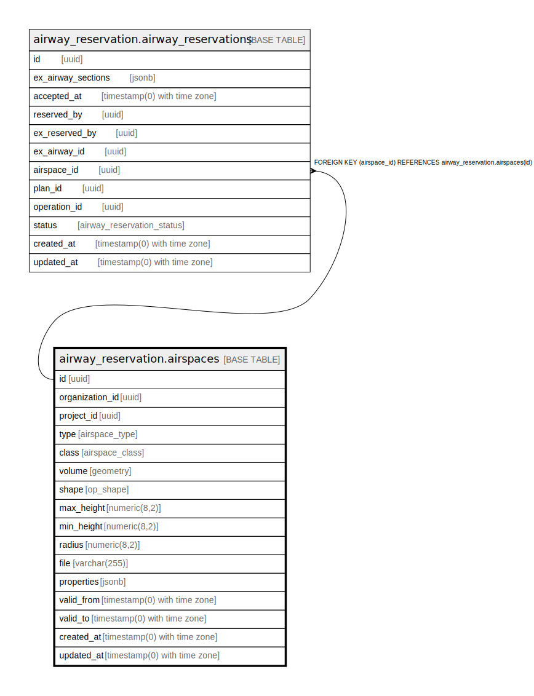

# airway_reservation.airspaces

## Description

## Columns

| Name | Type | Default | Nullable | Children | Parents | Comment |
| ---- | ---- | ------- | -------- | -------- | ------- | ------- |
| id | uuid | uuid_generate_v4() | false | [airway_reservation.airway_reservations](airway_reservation.airway_reservations.md) |  |  |
| organization_id | uuid |  | false |  |  |  |
| project_id | uuid |  | false |  |  |  |
| type | airspace_type |  | false |  |  |  |
| class | airspace_class |  | false |  |  |  |
| volume | geometry |  | false |  |  |  |
| shape | op_shape |  | false |  |  |  |
| max_height | numeric(8,2) |  | true |  |  |  |
| min_height | numeric(8,2) |  | true |  |  |  |
| radius | numeric(8,2) |  | true |  |  |  |
| file | varchar(255) |  | true |  |  |  |
| properties | jsonb |  | true |  |  |  |
| valid_from | timestamp(0) with time zone |  | true |  |  |  |
| valid_to | timestamp(0) with time zone |  | true |  |  |  |
| created_at | timestamp(0) with time zone | now() | false |  |  |  |
| updated_at | timestamp(0) with time zone | now() | false |  |  |  |

## Constraints

| Name | Type | Definition |
| ---- | ---- | ---------- |
| airspaces_pkey | PRIMARY KEY | PRIMARY KEY (id) |

## Indexes

| Name | Definition |
| ---- | ---------- |
| airspaces_pkey | CREATE UNIQUE INDEX airspaces_pkey ON airway_reservation.airspaces USING btree (id) |

## Relations

---

> Generated by [tbls](https://github.com/k1LoW/tbls)
