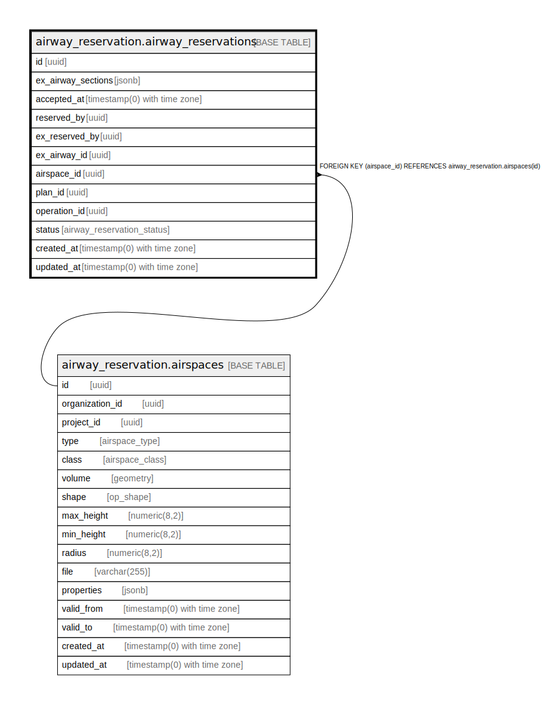

# airway_reservation.airway_reservations

## Description

## Columns

| Name | Type | Default | Nullable | Children | Parents | Comment |
| ---- | ---- | ------- | -------- | -------- | ------- | ------- |
| id | uuid | uuid_generate_v4() | false |  |  |  |
| ex_airway_sections | jsonb |  | false |  |  |  |
| accepted_at | timestamp(0) with time zone |  | true |  |  |  |
| reserved_by | uuid |  | true |  |  |  |
| ex_reserved_by | uuid |  | true |  |  |  |
| ex_airway_id | uuid |  | true |  |  |  |
| airspace_id | uuid |  | false |  | [airway_reservation.airspaces](airway_reservation.airspaces.md) |  |
| plan_id | uuid |  | true |  |  |  |
| operation_id | uuid |  | true |  |  |  |
| status | airway_reservation_status |  | false |  |  |  |
| created_at | timestamp(0) with time zone | now() | false |  |  |  |
| updated_at | timestamp(0) with time zone | now() | false |  |  |  |

## Constraints

| Name | Type | Definition |
| ---- | ---- | ---------- |
| fk_airway_reservations_airspace | FOREIGN KEY | FOREIGN KEY (airspace_id) REFERENCES airway_reservation.airspaces(id) |
| airway_reservations_pkey | PRIMARY KEY | PRIMARY KEY (id) |

## Indexes

| Name | Definition |
| ---- | ---------- |
| airway_reservations_pkey | CREATE UNIQUE INDEX airway_reservations_pkey ON airway_reservation.airway_reservations USING btree (id) |

## Relations

---

> Generated by [tbls](https://github.com/k1LoW/tbls)
